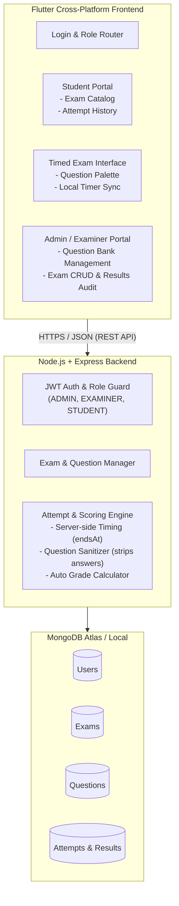

# 📝 College MCQ Examination System (ITLab-2)

[](https://flutter.dev/)
[](https://nodejs.org/)
[](https://expressjs.com/)
[](https://www.mongodb.com/)
[](https://opensource.org/licenses/MIT)
[](https://itlab-2.onrender.com)

A robust, full-stack, cross-platform **Online Multiple-Choice Question (MCQ) Examination Platform** developed for the 7th Semester Information Technology Lab course. 

The system features a **Flutter mobile/web frontend** connected to a **Node.js/Express + MongoDB backend**, featuring strict role-based access control, tamper-proof server-side test timing, randomized question delivery, automated score computation, and administrative analytics.

---

## 📌 Table of Contents

- [System Architecture](#-system-architecture)
- [Key Features](#-key-features)
- [Technology Stack](#-technology-stack)
- [Project Structure](#-project-structure)
- [Demo Credentials](#-demo-credentials)
- [API Reference](#-api-reference)
- [Getting Started](#-getting-started)
  - [Prerequisites](#prerequisites)
  - [Backend Setup](#backend-setup)
  - [Frontend Setup](#frontend-setup)
- [Exam Lifecycle & Business Rules](#-exam-lifecycle--business-rules)
- [Database Models](#-database-models)
- [Testing](#-testing)
- [Troubleshooting & Connection Tips](#-troubleshooting--connection-tips)

---

## 🏗 System Architecture

The application adopts a decoupled client-server architecture to guarantee security and academic integrity during examinations:



---

## ✨ Key Features

### 🔐 Authentication & Role-Based Access Control (RBAC)
- **Role Hierarchies:** Strict separation between `ADMIN`, `EXAMINER`, and `STUDENT` (or `CLIENT`).
- **Secure Token Flow:** Stateless JWT Bearer token authentication with configurable expiration.
- **One-Click Demo Fill:** Built-in demo login shortcuts on the mobile/web interface for rapid evaluation.

### ⏱ Tamper-Proof Exam Engine
- **Server-Driven Deadlines:** Start and end timestamps (`startedAt`, `endsAt`) are assigned by the backend. Client clocks cannot manipulate test durations.
- **Sanitized Question Delivery:** When an exam begins, correct answer keys and marks are completely stripped by the backend, ensuring students cannot inspect client-side network payloads to find solutions.
- **Randomized Question Subsets:** Pulls at least 10 questions for each active attempt.
- **Server-Side Grading:** Responses are validated and graded exclusively on the server upon submission. Score, percentage, and correctness metrics cannot be spoofed.
- **Automated Expiry Handling:** Late submissions past `endsAt` are marked as `EXPIRED` and rejected.

### 📊 Examiner & Admin Workspace
- **Analytics Overview:** Real-time summary dashboard reporting registered users, total exams, student attempts, and overall pass rates.
- **Exam Management:** Create, configure duration, edit, and toggle availability of exams.
- **Question Bank CRUD:** Add questions with 4 choices, configurable marks, and designated answer keys.
- **Attempt History Audit:** View detailed audit logs of all student test records, submission timestamps, percentages, and pass/fail indicators.

### 📱 Student Experience
- **Exam Catalog:** Browse available exams with real-time status and question counts.
- **Synchronized Active Exam View:** Real-time countdown timer, question palette for easy navigation, and answer selection state preservation.
- **Immediate Results:** Instantly review final score, percentage, correct/incorrect totals, and performance badges upon submission.
- **Attempt History Tab:** Persistent local history caching via `SharedPreferences` for quick offline review.
- **Dynamic Server URL Switcher:** Easily toggle between the live Render production server and local development environments directly from the UI.

---

## 💻 Technology Stack

| Layer | Technologies |
|---|---|
| **Frontend Framework** | [Flutter](https://flutter.dev/) (Dart 3.x), Material 3 Design |
| **State Management** | [Flutter Riverpod](https://pub.dev/packages/flutter_riverpod) (v3.4.2) |
| **Navigation & Routing** | [GoRouter](https://pub.dev/packages/go_router) (v17.5.0) |
| **Networking & HTTP** | [Dio](https://pub.dev/packages/dio) (v5.11.0) with custom Auth & BaseUrl interceptors |
| **Local Storage** | [SharedPreferences](https://pub.dev/packages/shared_preferences) |
| **Backend Runtime** | [Node.js](https://nodejs.org/) (ES Modules, `>= 20.x`) |
| **Web Server** | [Express.js](https://expressjs.com/) (v4.19.2) |
| **Database & ODM** | [MongoDB](https://www.mongodb.com/) via [Mongoose](https://mongoosejs.com/) (v9.9.3) |
| **Security & Auth** | JSON Web Tokens (`jsonwebtoken`), Node Crypto (`crypto`), CORS |
| **Deployment** | [Render](https://render.com/) (Production Web Service) |

---

## 📂 Project Structure

```text
ITLab-2/
├── backend/                        # Node.js Express REST API
│   ├── src/
│   │   ├── config/                 # Environment variables & MongoDB connection
│   │   │   ├── db.js               # Mongoose connection handler
│   │   │   └── env.js              # Validated environment settings
│   │   ├── controllers/            # Request handlers (auth, exam, question, attempt, admin)
│   │   ├── data/                   # Default database seeder
│   │   │   └── store.js            # User seeder logic
│   │   ├── middleware/             # Express middlewares (JWT auth, error handler)
│   │   │   ├── authMiddleware.js   # authenticate & role authorization guards
│   │   │   └── errorMiddleware.js  # 404 & unified error handling
│   │   ├── models/                 # Mongoose schemas (User, Exam, Question, Attempt)
│   │   ├── routes/                 # Express route definitions
│   │   ├── services/               # Core business logic (attempt engine, grading, data store)
│   │   │   ├── attemptService.js   # Timed exam lifecycle & scoring calculation
│   │   │   └── dataStore.js        # Mongoose query operations
│   │   ├── utils/                  # Helper utilities (password hashing)
│   │   ├── app.js                  # Express app setup & CORS configuration
│   │   └── server.js               # Server entry point & DB startup
│   ├── test/                       # Backend test suites
│   ├── .env.example                # Sample environment variables
│   └── package.json                # Backend dependencies and scripts
│
├── frontend/                       # Cross-Platform Flutter Application
│   ├── lib/
│   │   ├── core/                   # Application foundation
│   │   │   ├── network/            # Dio client & token interceptor
│   │   │   ├── router/             # GoRouter setup with role-based route guards
│   │   │   ├── storage/            # SharedPreferences wrapper
│   │   │   └── theme/              # AppTheme typography, colors & styles
│   │   ├── features/               # Feature-driven modular architecture
│   │   │   ├── admin/              # Admin dashboard, exam editor, question creator
│   │   │   ├── attempt/            # Attempt models, history service, & providers
│   │   │   ├── auth/               # Login screen, user model, auth state provider
│   │   │   ├── exam/               # Exam & question models, exam repository
│   │   │   └── student/            # Student dashboard, active exam, result view
│   │   └── main.dart               # Flutter main entry point
│   ├── pubspec.yaml                # Flutter dependencies & assets
│   └── test/                       # Flutter widget & unit tests
│
└── README.md                       # Master repository documentation
```

---

## 🔑 Demo Credentials

The backend automatically seeds these default accounts upon connecting to MongoDB if no users are present:

| Role | Email / Identifier | Password | Permitted Actions |
|---|---|---|---|
| **Admin** | `admin@example.com` | `admin123` | System analytics, full exam CRUD, question management, view student attempts |
| **Examiner** | `examiner@example.com` | `examiner123` | Create exams, manage own exams & questions, inspect attempts |
| **Student** | `student@example.com` | `student123` | Browse exams, start timed attempts, submit answers, view personal results |
| **Student 2**| `student2@example.com` | `student123` | Independent student account for concurrent testing |

> 💡 **Tip:** On the Flutter login screen, quick-fill buttons are provided so you can instantly log in as any role without manual typing.

---

## 📡 API Reference

Base URL (Production): `https://itlab-2.onrender.com`  
Base URL (Local): `http://localhost:5000`

All protected endpoints require an HTTP header: `Authorization: Bearer <token>`.

### 1. Authentication & System
| Method | Endpoint | Access | Request Body | Description |
|---|---|---|---|---|
| `GET` | `/health` | Public | None | Server health check |
| `POST` | `/api/auth/login` | Public | `{"email": "...", "password": "..."}` | Authenticates user; returns JWT token & user profile |

### 2. Exams
| Method | Endpoint | Access | Request Body | Description |
|---|---|---|---|---|
| `GET` | `/api/exams` | Authenticated | None | Lists available exams (questions sanitized) |
| `GET` | `/api/exams/:examId` | Authenticated | None | Retrieves exam details (answer keys omitted) |
| `POST` | `/api/exams` | ADMIN, EXAMINER | `{"title": "...", "durationMinutes": 30, "isAvailable": true}` | Creates a new exam |
| `PUT` | `/api/exams/:examId` | ADMIN, EXAMINER | Partial exam fields | Modifies exam properties |
| `DELETE` | `/api/exams/:examId` | ADMIN, EXAMINER | None | Removes exam and associated questions |

### 3. Questions
| Method | Endpoint | Access | Request Body | Description |
|---|---|---|---|---|
| `POST` | `/api/exams/:examId/questions` | ADMIN, EXAMINER | `{"text": "...", "options": ["A","B","C","D"], "correctAnswer": 0, "marks": 1}` | Adds an MCQ to an exam |
| `PUT` | `/api/questions/:questionId` | ADMIN, EXAMINER | Partial question fields | Updates an existing question |
| `DELETE`| `/api/questions/:questionId` | ADMIN, EXAMINER | None | Deletes a question |

### 4. Exam Attempts & Submissions
| Method | Endpoint | Access | Request Body | Description |
|---|---|---|---|---|
| `POST` | `/api/exams/:examId/start` | STUDENT, CLIENT | None | Starts timed attempt. Requires at least 10 questions. Returns safe questions and `startedAt`/`endsAt`. |
| `GET` | `/api/attempts/:attemptId` | STUDENT, CLIENT | None | Fetches details of own ongoing attempt |
| `POST` | `/api/attempts/:attemptId/submit` | STUDENT, CLIENT | `{"answers": [{"questionId": "...", "answerIndex": 1}]}` | Submits answers; evaluates score on server |
| `GET` | `/api/attempts/:attemptId/result` | STUDENT, CLIENT | None | Fetches final verified scorecard |

### 5. Admin Analytics
| Method | Endpoint | Access | Request Body | Description |
|---|---|---|---|---|
| `GET` | `/api/admin/summary` | ADMIN | None | Aggregated counts of users, exams, attempts |
| `GET` | `/api/admin/users` | ADMIN | None | List of registered users (password hashes excluded) |
| `GET` | `/api/admin/exams` | ADMIN | None | Comprehensive exam overview |

---

## 🚀 Getting Started

### Prerequisites
- **Node.js**: v20.x or higher
- **MongoDB**: Local MongoDB instance or free MongoDB Atlas URI
- **Flutter SDK**: v3.12 or higher (optional if running Flutter web/mobile locally)

---

### Backend Setup

1. **Navigate to the backend directory:**
   ```bash
   cd backend
   ```

2. **Install dependencies:**
   ```bash
   npm install
   ```

3. **Configure environment variables:**
   Copy the example environment configuration:
   ```bash
   cp .env.example .env
   ```
   Edit `.env` with your settings:
   ```env
   NODE_ENV=development
   PORT=5000
   CORS_ORIGIN=*
   JWT_SECRET=super_secret_jwt_key_here
   JWT_EXPIRES_IN_SECONDS=3600
   DATABASE_URL=mongodb+srv://<username>:<password>@cluster.mongodb.net/exam_system?retryWrites=true&w=majority
   ```

4. **Start the server:**
   ```bash
   # Development mode with auto-reload
   npm run dev

   # Or standard start
   npm start
   ```
   The backend will connect to MongoDB, seed default users if empty, and listen at `http://localhost:5000`.

---

### Frontend Setup

1. **Navigate to the frontend directory:**
   ```bash
   cd frontend
   ```

2. **Install Flutter packages:**
   ```bash
   flutter pub get
   ```

3. **Run the Flutter application:**
   - **On Chrome (Web):**
     ```bash
     flutter run -d chrome
     ```
   - **On Android Emulator:**
     ```bash
     flutter run -d emulator
     ```
   - **On Windows Desktop:**
     ```bash
     flutter run -d windows
     ```

4. **Configuring Backend URL in the App:**
   By default, the app connects to the hosted cloud server:
   `https://itlab-2.onrender.com`

   To connect to your local backend:
   - Click the **Gear / Server Settings icon** on the Login screen or Dashboard.
   - For **Chrome / Web**: Set URL to `http://localhost:5000`.
   - For **Android Emulator**: Set URL to `http://10.0.2.2:5000` (special loopback alias for host machine).
   - For **Physical Device**: Set URL to your computer's local network IP (e.g., `http://192.168.1.15:5000`).

---

## 🔄 Exam Lifecycle & Business Rules

1. **Creation & Question Requirement:**
   - Examiners create an exam (e.g. 30 minutes duration).
   - An exam must contain **at least 10 questions** before students are allowed to start it.
2. **Attempt Initialization:**
   - When a student initiates `/api/exams/:examId/start`, the server selects questions, logs `startedAt`, and computes the strict expiration time `endsAt = startedAt + (durationMinutes * 60s)`.
   - The question payload returned to the student strips out `correctAnswer` and `marks`.
3. **Execution & Auto-Submission:**
   - The Flutter client runs a local countdown timer bound to the server's `endsAt`.
   - When the countdown reaches `00:00`, the client automatically triggers submission.
4. **Grading & Validation:**
   - The backend checks:
     - Is the submitter the owner of the attempt?
     - Has the attempt already been submitted?
     - Has the attempt deadline expired?
   - The server compares each submitted `answerIndex` with the question's `correctAnswer` in MongoDB.
   - It calculates `score`, `percentage`, `correctAnswers`, and `incorrectAnswers`.
   - Results are permanently saved in the attempt record and returned to the student.

---

## 🗄 Database Models

### `User`
- `email`: String (unique, required)
- `username`: String (unique, required)
- `passwordHash`: String (required)
- `role`: Enum `['ADMIN', 'EXAMINER', 'STUDENT', 'CLIENT']`
- `active`: Boolean

### `Exam`
- `title`: String (required)
- `durationMinutes`: Number (required, min 1)
- `isAvailable`: Boolean (default true)
- `createdBy`: ObjectId -> `User`
- `availableFrom`: Date (optional)
- `availableUntil`: Date (optional)

### `Question`
- `examId`: ObjectId -> `Exam` (indexed)
- `text`: String (required)
- `options`: Array of 4 Strings
- `correctAnswer`: Number (0 to 3)
- `marks`: Number (default 1)

### `Attempt`
- `examId`: ObjectId -> `Exam`
- `userId`: ObjectId -> `User`
- `questionIds`: Array of ObjectIds -> `Question`
- `startedAt`: Date
- `endsAt`: Date
- `status`: Enum `['IN_PROGRESS', 'SUBMITTED', 'EXPIRED']`
- `answers`: Array of `{ questionId, answerIndex }`
- `result`: `{ totalQuestions, correctAnswers, incorrectAnswers, score, percentage, submittedAt }`

---

## 🧪 Testing

### Backend Unit Tests
Execute backend logic tests using Node's built-in test runner:
```bash
cd backend
npm test
```

### Frontend Widget & Model Tests
Run the Flutter test suite:
```bash
cd frontend
flutter test
```
The test suite covers:
- User role deserialization (`ADMIN`, `EXAMINER`, `STUDENT`)
- Question model validation and option length constraints
- Exam 10-question prerequisite validation
- Attempt and Result calculation parsing

---

## 💡 Troubleshooting & Connection Tips

- **Android Connection Error (`SocketException: Connection refused`)**:
  Android emulators cannot connect to `localhost`. Open the in-app server settings modal and enter `http://10.0.2.2:5000`.
- **CORS Issues on Web**:
  The backend is configured with permissive CORS headers (`Access-Control-Allow-Origin: *`) in `src/app.js` to enable web clients to communicate smoothly.
- **Render Free Tier Spin-up**:
  If using the hosted Render backend (`https://itlab-2.onrender.com`), the first request after inactivity may take 30–50 seconds while the free instance boots up. Check `/health` to verify that the service is live.

---

## 👥 Contributors

- **ITLab-2 Project Team** — 7th Semester B.Tech Information Technology
- Developed for collegiate evaluation and laboratory demonstrations.
